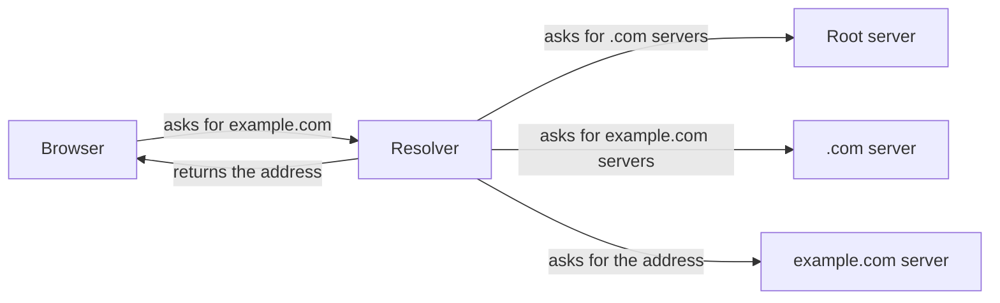

# Diagram mode

A diagram shows structure faster than prose. It also hides mistakes well: a missing arrow says "no connection" without a word. So each diagram comes with sentences that the reader can check.

## What to produce

1. One or two STE sentences that say what the diagram shows.
2. The diagram.
3. Below the diagram, **one STE sentence for each arrow**, in reading order.

## Choose the diagram type

| The idea is | Use |
|---|---|
| Steps in a sequence, with decisions | Flowchart |
| Messages between parts in time order | Sequence diagram |
| States and the events that change them | State diagram |
| Parts and what contains what | Block diagram |
| A comparison of two designs | Two small diagrams side by side, with the difference marked |

Draw the mechanism, not a list of names. A box that only says "cache" adds nothing. The path that a request takes through the cache does.

## Format

- Default to Mermaid in a fenced `mermaid` code block. The reader can read it, edit it and compare versions.
- If the surface does not render Mermaid, or the layout needs control, write a self-contained inline SVG. Use `currentColor` for lines and text so that it works in light and dark themes.
- **Animated version.** When the diagram goes into a `page` (see `html-page.md`), make it move. Use inline SVG. Move a dot along each arrow in the order of the numbered sentences, and light up the node that receives it. Add a Pause button. The animation must show the same arrows as the static diagram. In a chat or a document, give the static Mermaid diagram.
- If you cannot render anything, give an indented text outline and the arrow sentences.

## Rules

- Maximum 12 nodes. If you need more, split the idea into two diagrams.
- Label every arrow with a verb: `sends`, `reads`, `starts`, `returns 404`. An arrow with no label only says "related".
- Use the same name for a thing in the diagram and in the text.
- Node labels: maximum four words. Put sentences below the diagram, not in it.
- Keep each "if", "unless" and "not verified" from the explanation. Put a condition on the arrow label or on a decision node.
- Use one accent colour, only for the part that the question is about.

## Example

1. The browser asks the resolver for the address of example.com.
2. The resolver asks a root server which servers know `.com`.
3. The resolver asks a `.com` server which servers know example.com.
4. The resolver asks the example.com server for the address.
5. The resolver returns the address to the browser.

## Sources

If you did research (see `research.md`), put a numbered "Sources" list under the arrow sentences, and add the source number to each sentence that states a fact from a source.

## Before you deliver

- Count the arrows. Count the sentences. The two numbers must be equal.
- Read each sentence against the source. An arrow that points the wrong way is the most common error.
